# PythonID Group Management Bot

A comprehensive Telegram bot for managing group members with profile verification, captcha challenges, and anti-spam protection.

## Features

### Core Monitoring
- Monitors all messages in one or more configured groups
- **Multi-group support**: Manage multiple groups from a single bot instance with isolated per-group settings via `groups.json`
- Checks if users have a public profile picture
- Checks if users have a username set
- Sends warnings to a dedicated topic (thread) for non-compliant users
- **Warning topic protection**: Only admins and the bot can post in the warning topic (messages + edited messages)

### Restriction & Unrestriction
- **Progressive restriction**: Optional mode to restrict users after multiple warnings (message-based)
- **Time-based auto-restriction**: Automatically restricts users after X hours from first warning
- **Scheduled job**: Background scheduler checks and enforces time-based restrictions every 5 minutes
- **DM unrestriction flow**: Restricted users can DM the bot to get unrestricted after completing their profile

### New Member Protection
- **Captcha verification**: New members must verify they're human before joining (optional)
- **Captcha timeout recovery**: Automatically recovers pending verifications after bot restart
- **New user probation**: New members restricted from sending links/forwarded messages for 3 days (configurable)
- **Contact card blocking**: Prevents all non-admin members from sharing contact cards/phone numbers (delete + restrict)
- **Duplicate message detection**: Flags repeated near-identical messages within a configurable window
- **Bio-bait detection**: Catches obfuscated "check my bio" bait phrases and suspicious promo links in a sender's Telegram profile bio (monitor-only mode available)
- **Anti-spam enforcement**: Tracks violations and restricts spammers after threshold
- **Trusted users**: Admin-managed trusted list to bypass anti-spam + duplicate-spam checks

### Admin Tools
- **/verify command**: Whitelist users with hidden profile pictures (DM only)
- **/unverify command**: Remove users from verification whitelist (DM only)
- **Inline verification**: Forward messages to bot for quick verify/unverify buttons
- **/trust command**: Add trusted users (DM only, supports user ID or forwarded message)
- **/untrust command**: Remove trusted users from trusted list (DM only)
- **/trusted command**: List all trusted users (DM only)
- **Automatic clearance**: Sends notification when verified users' warnings are cleared

## Requirements

- Python 3.11+
- [uv](https://docs.astral.sh/uv/) package manager

## Setup

### 1. Create Your Bot

1. Open Telegram and search for [@BotFather](https://t.me/BotFather)
2. Send `/newbot` and follow the prompts
3. Copy the bot token you receive

### 2. Set Up Your Group

1. Create a new group or use an existing one
2. **Enable Topics** in the group:
   - Go to Group Settings → Topics → Enable Topics
3. Create a topic for bot warnings (e.g., "Bot Warnings" or "Profile Alerts")
4. Add your bot to the group as an **Administrator** with these permissions:
   - Read messages
   - Send messages
   - Delete messages (for warning topic protection)
   - Restrict members (for progressive restriction mode)

### 3. Get Group ID

**Option A: Using @userinfobot**
1. Add [@userinfobot](https://t.me/userinfobot) to your group
2. The bot will reply with the group ID (negative number starting with `-100`)
3. Remove the bot after getting the ID

**Option B: Using your bot**
1. Temporarily add this handler to your bot to print chat IDs:
   ```python
   async def debug_handler(update, context):
       print(f"Chat ID: {update.effective_chat.id}")
   ```
2. Send a message in the group and check the console

### 4. Get Topic ID (message_thread_id)

**Option A: From message link**
1. Right-click any message in your warning topic
2. Click "Copy Message Link"
3. The link format is: `https://t.me/c/XXXXXXXXXX/TOPIC_ID/MESSAGE_ID`
4. The `TOPIC_ID` is the number you need (e.g., `123`)

**Option B: From forwarded message**
1. Forward a message from the topic to [@userinfobot](https://t.me/userinfobot)
2. Look for the `message_thread_id` in the response

**Note:** The "General" topic has ID `1`. Custom topics have higher IDs.

### 5. Configure Environment

```bash
cp .env.example .env
```

Edit `.env` with your values:

```env
TELEGRAM_BOT_TOKEN=123456789:ABCdefGHIjklMNOpqrSTUvwxYZ
GROUP_ID=-1001234567890
WARNING_TOPIC_ID=42
RESTRICT_FAILED_USERS=false
WARNING_THRESHOLD=3
WARNING_TIME_THRESHOLD_MINUTES=180
RULES_LINK=https://t.me/yourgroup/rules
```

### 6. Multi-Group Configuration (Optional)

To manage multiple groups from a single bot instance, use a `groups.json` configuration file:

```bash
cp groups.json.example groups.json
```

Add `GROUPS_CONFIG_PATH=groups.json` to your `.env` file, then edit `groups.json`:

```json
[
  {
    "group_id": -1001234567890,
    "warning_topic_id": 123,
    "restrict_failed_users": false,
    "warning_threshold": 3,
    "warning_time_threshold_minutes": 180,
    "captcha_enabled": false,
    "captcha_timeout_seconds": 120,
    "new_user_probation_hours": 72,
    "new_user_violation_threshold": 3,
    "rules_link": "https://t.me/pythonID/290029/321799"
  },
  {
    "group_id": -1009876543210,
    "warning_topic_id": 456,
    "restrict_failed_users": true,
    "warning_threshold": 5,
    "warning_time_threshold_minutes": 60,
    "captcha_enabled": true,
    "captcha_timeout_seconds": 180,
    "new_user_probation_hours": 168,
    "new_user_violation_threshold": 2,
    "rules_link": "https://t.me/mygroup/rules"
  }
]
```

When `groups.json` is present, per-group settings override the `.env` defaults. Each group can have its own warning thresholds, captcha settings, probation rules, and rules link. Each group entry can also add a `"plugins": {"bio_bait_spam": false}`-style object to disable specific built-in plugins just for that group, overriding the bot-wide `PLUGINS_DEFAULT`.

**Backward compatibility**: If no `groups.json` is configured (i.e., `GROUPS_CONFIG_PATH` is not set), the bot falls back to single-group mode using `GROUP_ID`, `WARNING_TOPIC_ID`, and other settings from `.env`.

## Installation

```bash
# Install dependencies (including dev tools: ruff, mypy, hypothesis, pytest)
uv sync --dev

# Run the bot (production)
uv run pythonid-bot

# Run the bot (staging)
BOT_ENV=staging uv run pythonid-bot

# Stop gracefully with Ctrl+C
# The bot will properly shut down the JobQueue scheduler before exiting
```

## Environment Configuration

The bot supports multiple environments via the `BOT_ENV` variable:

| BOT_ENV | Config File |
|---------|-------------|
| `production` (default) | `.env` |
| `staging` | `.env.staging` |

```bash
# Production (default)
uv run pythonid-bot

# Staging
BOT_ENV=staging uv run pythonid-bot
```

## Testing

```bash
# Run tests
uv run pytest

# Run tests with coverage
uv run pytest --cov=bot --cov-report=term-missing

# Run tests verbosely
uv run pytest -v

# Run only property-based tests
uv run pytest tests/test_properties.py -v

# Type check
uv run mypy src/bot/ tests/
```

### Test Coverage

The project maintains comprehensive test coverage:
- **Coverage**: 98%+ (~2,500 statements, <2% unreachable)
- **Tests**: 977+ total (includes 19 Hypothesis property tests)
- **Pass Rate**: 100%
- **Property tests**: `tests/test_properties.py` exercises pure functions (format helpers, URL whitelist, name formatters) with random inputs and shrinks failing cases to minimal examples
- **Mypy**: Pragmatic config in `pyproject.toml`. Disables error codes that are noisy from PTB / SQLModel / Pydantic v2; catches real type bugs in new code

All modules are fully unit tested with:
- Mocked async dependencies (telegram bot API calls)
- Edge case handling (errors, empty results, boundary conditions)
- Database initialization and schema validation
- Background job testing (JobQueue integration, job configuration, auto-restriction logic)
- Captcha verification flow (new member handling, callback verification, timeout handling, profile photo + username check)
- Anti-spam protection (contact cards, inline keyboards, forwarded messages, URL whitelisting, external replies)
- Plugin registration (built-in plugins wired through `PluginManager`)

## Project Structure

```
PythonID/
├── pyproject.toml
├── .env                  # Your configuration (not committed)
├── .env.example          # Example configuration
├── README.md
├── AGENTS.md             # Developer guidance for the codebase
├── data/
│   └── bot.db            # SQLite database (auto-created)
├── scripts/
│   └── backfill_trusted_names.py  # One-shot backfill for /trusted admin names
├── tests/
│   ├── test_anti_spam.py
│   ├── test_backfill_trusted_names.py
│   ├── test_bot_info.py
│   ├── test_captcha.py
│   ├── test_captcha_recovery.py
│   ├── test_check.py
│   ├── test_config.py
│   ├── test_constants.py
│   ├── test_database.py
│   ├── test_dm_handler.py
│   ├── test_duplicate_spam.py
│   ├── test_group_config.py
│   ├── test_main_plugins_bootstrap.py
│   ├── test_message_handler.py
│   ├── test_photo_verification.py
│   ├── test_plugin_captcha.py
│   ├── test_plugin_config.py
│   ├── test_plugin_definitions.py
│   ├── test_plugin_manager.py
│   ├── test_properties.py       # Hypothesis property-based tests
│   ├── test_scheduler.py
│   ├── test_telegram_utils.py
│   ├── test_topic_guard.py
│   ├── test_trust_handler.py
│   ├── test_user_checker.py
│   ├── test_verify_handler.py
│   └── test_whitelist.py
└── src/
    └── bot/
        ├── main.py              # Entry point with JobQueue integration + PluginManager bootstrap
        ├── config.py            # Pydantic settings
        ├── constants.py         # Shared constants
        ├── group_config.py      # Multi-group configuration (GroupConfig, GroupRegistry)
        ├── plugins/             # Modular plugin system
        │   ├── manager.py       # PluginManager — discovers + registers built-ins
        │   ├── definitions.py   # Plugin class contract
        │   ├── config.py        # guard_plugin("name") per-group runtime gate
        │   └── builtin/         # One plugin per handler domain
        │       ├── captcha.py
        │       ├── profile_monitor.py
        │       ├── spam.py
        │       ├── topic_guard.py
        │       ├── commands.py
        │       ├── dm.py
        │       └── jobs.py
        ├── handlers/            # Underlying handler implementations (wrapped by plugins)
        │   ├── anti_spam.py     # Anti-spam (contact cards, inline keyboards, probation)
        │   ├── captcha.py       # Captcha + profile photo/username check
        │   ├── dm.py            # DM unrestriction handler
        │   ├── message.py       # Group message handler
        │   ├── topic_guard.py   # Warning topic protection
        │   ├── trust.py         # /trust, /untrust, /trusted admin commands
        │   ├── verify.py        # /verify and /unverify command handlers
        │   ├── duplicate_spam.py # Duplicate message detection
        │   └── bio_bait.py      # Bio-bait spam (bait phrases + suspicious profile bio links)
        ├── database/
        │   ├── models.py        # SQLModel schemas (5 tables)
        │   └── service.py       # Database operations
        └── services/
            ├── admin_cache.py        # Admin ID cache + refresh
            ├── bot_info.py           # Bot info caching
            ├── captcha_recovery.py   # Captcha timeout recovery
            ├── scheduler.py          # JobQueue background job
            ├── telegram_utils.py     # Shared telegram utilities
            └── user_checker.py       # Profile validation
```

## Bot Workflow

The following diagram illustrates the complete bot workflow including captcha verification, anti-spam protection, profile monitoring, restriction logic, DM unrestriction, admin verification, and background scheduler jobs:

```mermaid
flowchart TD
    Start([Bot Starts]) --> Init[Initialize Database & Config]
    Init --> FetchAdmins[Fetch Group Admin IDs]
    FetchAdmins --> RecoverCaptcha{Captcha<br/>Enabled?}
    RecoverCaptcha -->|Yes| RecoverPending[Recover Pending Captchas]
    RecoverCaptcha -->|No| StartJobs
    RecoverPending --> StartJobs[Start JobQueue Scheduler<br/>5-minute interval]
    StartJobs --> Poll[Poll for Updates]
    
    Poll --> UpdateType{Update Type?}
    
    %% New Member Flow
    UpdateType -->|New Member| CheckCaptchaEnabled{Captcha<br/>Enabled?}
    CheckCaptchaEnabled -->|No| StartProbation[Start Probation Only]
    CheckCaptchaEnabled -->|Yes| RestrictAndChallenge[Restrict & Send Captcha]
    RestrictAndChallenge --> StorePending[(Store Pending Validation)]
    StorePending --> ScheduleTimeout[Schedule Timeout Job]
    ScheduleTimeout --> WaitCaptcha[Wait for Verification]
    
    WaitCaptcha --> CaptchaAnswer{User<br/>Action?}
    CaptchaAnswer -->|Correct Button| CancelTimeout[Cancel Timeout Job]
    CancelTimeout --> UnrestrictMember[Unrestrict Member]
    UnrestrictMember --> StartProbationAfter[Start Probation]
    CaptchaAnswer -->|Wrong User| ShowError[Show Error Message]
    CaptchaAnswer -->|Timeout| KickMember[Keep Restricted]
    KickMember --> UpdateMessage[Update Challenge Message]
    
    %% Anti-Spam Flow (Contact Card + New User Probation)
    UpdateType -->|Group Message| CheckContact{Has Contact<br/>Card?}
    CheckContact -->|Yes| CheckContactAdmin{Is Admin?}
    CheckContactAdmin -->|Yes| CheckProbation
    CheckContactAdmin -->|No| DeleteContact[Delete Contact Message]
    DeleteContact --> RestrictContact[Restrict User]
    RestrictContact --> SendContactNotify[Send Contact<br/>Spam Notification]
    CheckContact -->|No| CheckProbation
    CheckProbation{User On<br/>Probation?} -->|No| CheckBot
    CheckProbation -->|Yes| CheckExpired{Probation<br/>Expired?}
    CheckExpired -->|Yes| ClearProbation[(Clear Probation)]
    CheckExpired -->|No| CheckViolation{Forward/Link/<br/>External Reply?}
    
    CheckViolation -->|No| End1([Continue])
    CheckViolation -->|Yes| CheckWhitelisted{URL<br/>Whitelisted?}
    CheckWhitelisted -->|Yes| End1
    CheckWhitelisted -->|No| DeleteSpam[Delete Message]
    DeleteSpam --> IncrementViolation[(Increment Violation)]
    IncrementViolation --> ViolationCount{Violation<br/>Count?}
    
    ViolationCount -->|First| SendSpamWarning[Send Probation Warning]
    ViolationCount -->|< Threshold| End2([Done])
    ViolationCount -->|>= Threshold| RestrictSpammer[Restrict User]
    RestrictSpammer --> SendSpamRestriction[Send Restriction Notice]
    
    %% Group Message Flow - Topic Guard
    CheckBot{From Bot?}
    CheckBot -->|Yes| End3([Ignore])
    CheckBot -->|No| TopicGuard{In Warning<br/>Topic?}
    TopicGuard -->|Yes| IsAdmin{Is Admin<br/>or Bot?}
    IsAdmin -->|No| DeleteMsg[Delete Message]
    IsAdmin -->|Yes| End4([Allow])
    
    %% Group Message Flow - Profile Check
    TopicGuard -->|No| CheckWhitelist{User<br/>Whitelisted?}
    CheckWhitelist -->|Yes| End5([Allow])
    CheckWhitelist -->|No| CheckProfile[Check User Profile:<br/>Photo + Username]
    
    CheckProfile --> ProfileComplete{Profile<br/>Complete?}
    ProfileComplete -->|Yes| End6([Allow])
    ProfileComplete -->|No| CheckMode{Restriction<br/>Mode?}
    
    %% Warning Mode
    CheckMode -->|Warning Only| SendWarning[Send Warning to Topic<br/>Time threshold mentioned]
    SendWarning --> End7([Done])
    
    %% Progressive Restriction Mode
    CheckMode -->|Progressive| CheckCount{Message<br/>Count?}
    CheckCount -->|First Message| SendFirstWarning[Send Warning with<br/>Message & Time Thresholds]
    SendFirstWarning --> IncrementDB[(Store Warning in DB<br/>with timestamp)]
    IncrementDB --> End8([Done])
    
    CheckCount -->|2 to N-1| SilentIncrement[(Silent: Increment Count)]
    SilentIncrement --> End9([Done])
    
    CheckCount -->|>= Threshold| RestrictUser[Apply Restriction<br/>Mute Permissions]
    RestrictUser --> MarkRestricted[(Mark as Restricted<br/>in Database)]
    MarkRestricted --> SendRestrictionMsg[Send Restriction Notice<br/>with DM Link]
    SendRestrictionMsg --> End10([Done])
    
    %% DM Flow
    UpdateType -->|Private Message| CheckInGroup{User in<br/>Group?}
    CheckInGroup -->|No| SendNotInGroup[Send: Not in Group]
    CheckInGroup -->|Yes| CheckPendingCaptcha{Has Pending<br/>Captcha?}
    
    CheckPendingCaptcha -->|Yes| SendCaptchaRedirect[Send: Complete Captcha<br/>in Group First]
    CheckPendingCaptcha -->|No| CheckDMProfile[Check Profile]
    
    CheckDMProfile --> DMProfileComplete{Profile<br/>Complete?}
    DMProfileComplete -->|No| SendMissing[Send: Missing Items]
    DMProfileComplete -->|Yes| CheckBotRestricted{Restricted<br/>by Bot?}
    
    CheckBotRestricted -->|No| SendNoRestriction[Send: No Bot Restriction]
    CheckBotRestricted -->|Yes| CheckCurrentStatus{Currently<br/>Restricted?}
    
    CheckCurrentStatus -->|No| ClearRecord[(Clear Database Record)]
    ClearRecord --> SendAlreadyUnrestricted[Send: Already Unrestricted]
    
    CheckCurrentStatus -->|Yes| UnrestrictUser[Remove Restriction]
    UnrestrictUser --> ClearRecord2[(Clear Database Record)]
    ClearRecord2 --> SendSuccess[Send: Success Message]
    
    %% Scheduler Job (Background)
    StartJobs -.->|Every 5 min| SchedulerJob[Auto-Restriction Job]
    SchedulerJob --> QueryDB[(Query Warnings Past<br/>Time Threshold)]
    QueryDB --> HasExpired{Expired<br/>Warnings?}
    
    HasExpired -->|No| EndJob([Wait Next Cycle])
    HasExpired -->|Yes| CheckKicked{User<br/>Kicked?}
    
    CheckKicked -->|Yes| ClearKicked[(Clear Record)]
    ClearKicked --> NextUser{More<br/>Users?}
    
    CheckKicked -->|No| ApplyTimeRestriction[Apply Restriction<br/>Mute Permissions]
    ApplyTimeRestriction --> MarkTimeRestricted[(Mark as Restricted)]
    MarkTimeRestricted --> SendTimeNotice[Send Time-Based<br/>Restriction Notice]
    SendTimeNotice --> NextUser
    
    NextUser -->|Yes| CheckKicked
    NextUser -->|No| EndJob
    
    %% Command Handlers - Verify/Unverify
    UpdateType -->|/verify Command| CheckAdminVerify{Is Admin?}
    CheckAdminVerify -->|No| DenyVerify[Send: Admin Only]
    CheckAdminVerify -->|Yes| AddWhitelist[(Add User to<br/>Photo Whitelist)]
    AddWhitelist --> UnrestrictVerified[Unrestrict User]
    UnrestrictVerified --> DeleteWarnings[(Delete Warning Records)]
    DeleteWarnings --> CheckWarningsExist{Had<br/>Warnings?}
    CheckWarningsExist -->|Yes| SendClearance[Send Clearance Notification<br/>to Warning Topic]
    CheckWarningsExist -->|No| SendVerifySuccess[Send: User Verified]
    SendClearance --> SendVerifySuccess
    
    UpdateType -->|/unverify Command| CheckAdminUnverify{Is Admin?}
    CheckAdminUnverify -->|No| DenyUnverify[Send: Admin Only]
    CheckAdminUnverify -->|Yes| RemoveWhitelist[(Remove from Whitelist)]
    RemoveWhitelist --> SendUnverifySuccess[Send: User Unverified]
    
    %% Forwarded Message Handler
    UpdateType -->|Forwarded Message<br/>in DM| CheckAdminForward{Is Admin?}
    CheckAdminForward -->|No| DenyForward[Send: Admin Only]
    CheckAdminForward -->|Yes| ExtractUser{Extract<br/>User Info?}
    ExtractUser -->|Success| SendButtons[Send Verify/Unverify Buttons]
    ExtractUser -->|Failed| SendExtractError[Send: Cannot Extract User]
    
    %% Callback Handlers
    UpdateType -->|Verify Button| ProcessVerify[Process Verify Callback]
    ProcessVerify --> AddWhitelist
    UpdateType -->|Unverify Button| ProcessUnverify[Process Unverify Callback]
    ProcessUnverify --> RemoveWhitelist
    
    classDef processNode fill:#1a1a2e,stroke:#16213e,color:#eee
    classDef decisionNode fill:#0f3460,stroke:#16213e,color:#eee
    classDef dataNode fill:#16213e,stroke:#0f3460,color:#eee
    classDef actionNode fill:#533483,stroke:#16213e,color:#eee
    classDef endNode fill:#e94560,stroke:#16213e,color:#eee
    classDef startNode fill:#1a5f7a,stroke:#16213e,color:#eee
    
    class Init,FetchAdmins,RecoverPending,StartJobs,Poll,CheckProfile,CheckDMProfile,RestrictAndChallenge,StorePending,ScheduleTimeout,WaitCaptcha,StartProbation,StartProbationAfter processNode
    class UpdateType,RecoverCaptcha,TopicGuard,IsAdmin,CheckBot,CheckWhitelist,ProfileComplete,CheckMode,CheckCount,CheckInGroup,CheckPendingCaptcha,DMProfileComplete,CheckBotRestricted,CheckCurrentStatus,HasExpired,CheckKicked,NextUser,CheckAdminVerify,CheckAdminUnverify,CaptchaAnswer,CheckCaptchaEnabled,CheckProbation,CheckExpired,CheckViolation,CheckWhitelisted,ViolationCount,CheckWarningsExist,CheckAdminForward,ExtractUser,CheckContact,CheckContactAdmin decisionNode
    class IncrementDB,SilentIncrement,MarkRestricted,ClearRecord,ClearRecord2,QueryDB,ClearKicked,MarkTimeRestricted,AddWhitelist,RemoveWhitelist,IncrementViolation,ClearProbation,DeleteWarnings dataNode
    class DeleteMsg,SendWarning,SendFirstWarning,RestrictUser,SendRestrictionMsg,SendNotInGroup,SendCaptchaRedirect,SendMissing,SendNoRestriction,SendAlreadyUnrestricted,UnrestrictUser,SendSuccess,ApplyTimeRestriction,SendTimeNotice,SchedulerJob,SendVerifySuccess,SendUnverifySuccess,DenyVerify,DenyUnverify,UnrestrictMember,KickMember,UpdateMessage,CancelTimeout,ShowError,DeleteSpam,SendSpamWarning,RestrictSpammer,SendSpamRestriction,UnrestrictVerified,SendClearance,DenyForward,SendButtons,SendExtractError,ProcessVerify,ProcessUnverify,DeleteContact,RestrictContact,SendContactNotify actionNode
    class End1,End2,End3,End4,End5,End6,End7,End8,End9,End10,EndJob,StartProbation endNode
    class Start startNode
```



## How It Works

### Architecture

The bot is organized into clear modules for maintainability:

- **main.py**: Entry point with python-telegram-bot's JobQueue integration, plugin manager bootstrap, admin cache refresh, and graceful shutdown
- **plugins/**: Modular plugin system. `PluginManager` discovers built-in plugins in `src/bot/plugins/builtin/`, each wrapping a handler module with per-group runtime gating via `guard_plugin("name")`. Add a new plugin by dropping a file in `builtin/`
- **handlers/**: Message processing logic (priority groups -1 through 4). Plugin wrappers transparently apply `guard_plugin`, so changes to handler internals flow through without plugin updates
  - `topic_guard.py`: Protects warning topic (group=-1, messages + edited messages, fail-closed)
  - `message.py`: Monitors group messages and sends warnings/restrictions (group=5)
  - `dm.py`: Handles DM unrestriction flow
  - `captcha.py`: Captcha verification for new members, including profile photo + username check
  - `anti_spam.py`: Inline keyboard spam (group=1) + contact card spam (group=2) + new user probation enforcement (group=3)
  - `duplicate_spam.py`: Repeated message detection (group=4)
  - `bio_bait.py`: Obfuscated bait-phrase + suspicious profile-bio link detection (group=4, monitor-only mode available)
  - `verify.py`: /verify and /unverify command handlers
  - `check.py`: /check command + forwarded message handling
  - `trust.py`: /trust, /untrust, /trusted admin commands (TrustedUser table caches names at trust time so /trusted renders without API calls)
- **services/**: Business logic and utilities
  - `scheduler.py`: JobQueue background job that runs every 5 minutes for time-based auto-restrictions
  - `user_checker.py`: Profile validation (photo + username check) — used by both the captcha gate and the per-message monitor
  - `bot_info.py`: Caches bot metadata to avoid repeated API calls
  - `telegram_utils.py`: Shared telegram utilities (user status checks, etc.)
  - `captcha_recovery.py`: Captcha timeout recovery on bot restart
  - `admin_cache.py`: Admin ID cache + 10-minute refresh job
- **database/**: Data persistence
  - `service.py`: Database operations with SQLite
  - `models.py`: Data models using SQLModel (UserWarning, PhotoVerificationWhitelist, PendingCaptchaValidation, NewUserProbation, TrustedUser)
- **config.py**: Environment configuration using Pydantic
- **group_config.py**: Multi-group configuration management (GroupConfig model, GroupRegistry for O(1) lookup, groups.json loading with .env fallback)
- **constants.py**: Centralized message templates and utilities for consistent formatting across handlers
- **scripts/**: Operator one-shots (`scripts/backfill_trusted_names.py` for pre-existing /trusted rows)

### Captcha Verification with Profile Check

New members are restricted immediately on join and presented with a captcha button. The verification flow now requires both the captcha click **and** a complete Telegram profile (public profile photo + username) before unrestriction:

1. New member joins → bot restricts them + sends captcha message + schedules timeout job
2. User clicks the captcha button within `CAPTCHA_TIMEOUT_SECONDS`
3. Bot calls `check_user_profile()` to verify photo + username
4. If profile is **complete**: remove pending captcha → start probation → unrestrict → cancel timeout
5. If profile is **incomplete**: alert shows the missing items, captcha record preserved, timeout still armed — user can fix profile and click again

The DB finalization (remove pending + start probation) runs before the Telegram `unrestrict_user` call, so a DB write failure leaves the user still restricted with state intact instead of leaking an inconsistent state.

### Group Message Monitoring
1. Bot listens to all text messages in the configured group
2. For each message, it checks if the sender has:
    - A public profile picture (using `get_user_profile_photos`)
    - A username set
3. If either is missing:
    - **Warning mode** (default): Sends a warning to the designated topic
    - **Restrict mode**: Progressive enforcement (see below)

### Progressive Restriction Mode (Message-Based)
When `RESTRICT_FAILED_USERS=true`:
1. **First message** → Warning sent to warning topic (mentions message and time thresholds)
2. **Messages 2 to (N-1)** → Silent (no spam)
3. **Message N** → User restricted, notification sent with DM link

Users are restricted when **either**:
- They send N messages (message threshold), OR
- X hours pass since first warning (time threshold)

Whichever happens first triggers the restriction.

### Time-Based Auto-Restriction
The bot runs a JobQueue background job every 5 minutes that:
1. Queries the database for warnings older than `WARNING_TIME_THRESHOLD_MINUTES`
2. Restricts those users (applies mute permissions)
3. Sends notifications to the warning topic with the DM link
4. Marks them as restricted in the database

This ensures users cannot evade restrictions by simply not sending messages.

### Admin Cache Refresh
Admin IDs are fetched at startup and refreshed every 10 minutes via a JobQueue job. If the refresh fails for a group, the bot falls back to the previously cached data (never an empty list). Spam handlers use the cached admin IDs for fast lookups, while the topic guard uses live `get_chat_member` API calls for maximum accuracy.

### Message Templates and Constants
All warning and restriction messages are centralized in `constants.py` for consistency:
- `WARNING_MESSAGE_NO_RESTRICTION`: Used in warning-only mode
- `WARNING_MESSAGE_WITH_THRESHOLD`: Used in progressive restriction mode (first message)
- `RESTRICTION_MESSAGE_AFTER_MESSAGES`: Sent when message threshold is reached
- `RESTRICTION_MESSAGE_AFTER_TIME`: Sent when time threshold is reached
- `format_threshold_display()`: Helper function that converts minutes to Indonesian format ("X jam" or "Y menit")

All messages are formatted with proper Indonesian language patterns and include links to group rules and bot DM for unrestriction appeals.

### Warning Topic Protection
- Only group administrators and the bot itself can post in the warning topic
- Messages and edited messages from regular users are automatically deleted
- Uses `ApplicationHandlerStop` to prevent downstream handlers from processing warning-topic traffic
- **Fail-closed**: On API errors, messages in the warning topic are deleted (erring on the side of protection)

### DM Unrestriction Flow
When a restricted user DMs the bot (or sends `/start`):
1. Bot checks if user is in the group
2. Bot checks if user now has complete profile (photo + username)
3. If complete and user was restricted by the bot, restriction is lifted
4. If user was restricted by an admin (not the bot), they're told to contact admin

## Configuration Options

| Variable | Description | Default |
|----------|-------------|---------|
| `TELEGRAM_BOT_TOKEN` | Bot token from @BotFather | Required |
| `GROUP_ID` | Group ID to monitor (negative number) | Required |
| `WARNING_TOPIC_ID` | Topic ID for warning messages | Required |
| `RESTRICT_FAILED_USERS` | Enable progressive restriction mode | `false` |
| `WARNING_THRESHOLD` | Messages before restriction (message-based) | `3` |
| `WARNING_TIME_THRESHOLD_MINUTES` | Minutes before auto-restriction (time-based) | `180` (3 hours) |
| `CAPTCHA_ENABLED` | Enable captcha verification for new members | `false` |
| `CAPTCHA_TIMEOUT_SECONDS` | Seconds before kicking unverified members | `120` (2 minutes) |
| `NEW_USER_PROBATION_HOURS` | Hours new users can't send links/forwards | `72` (3 days) |
| `NEW_USER_VIOLATION_THRESHOLD` | Spam violations before restriction | `3` |
| `CONTACT_SPAM_RESTRICT` | Restrict users who share contact cards | `true` |
| `DUPLICATE_SPAM_ENABLED` | Enable duplicate-message detection | `true` |
| `DUPLICATE_SPAM_WINDOW_SECONDS` | Window to compare messages for duplicates | `120` |
| `DUPLICATE_SPAM_THRESHOLD` | Repeats within window before flagging | `2` |
| `DUPLICATE_SPAM_MIN_LENGTH` | Minimum message length considered | `20` |
| `DUPLICATE_SPAM_SIMILARITY` | Similarity ratio (0-1) to count as duplicate | `0.95` |
| `BIO_BAIT_ENABLED` | Enable bio-bait phrase/link detection | `true` |
| `BIO_BAIT_MONITOR_ONLY` | Log/alert only, skip delete + restrict | `false` |
| `BIO_BAIT_ALERT_CHAT_ID` | Chat ID to receive monitor-only detection alerts | None |
| `DATABASE_PATH` | SQLite database path | `data/bot.db` |
| `RULES_LINK` | Link to group rules message | `https://t.me/pythonID/290029/321799` |
| `LOGFIRE_ENABLED` | Enable Logfire logging integration | `true` |
| `LOGFIRE_TOKEN` | Logfire API token (optional) | None |
| `LOG_LEVEL` | Logging level (DEBUG/INFO/WARNING/ERROR) | `INFO` |
| `GROUPS_CONFIG_PATH` | Path to `groups.json` for multi-group support | None (single-group mode from `.env`) |
| `PLUGINS_DEFAULT` | Bot-wide plugin enable/disable defaults (JSON object, e.g. `{"bio_bait_spam": false}`) | `{}` (all enabled) |

### Restriction Modes

- **Warning Mode** (default, `RESTRICT_FAILED_USERS=false`): Users receive warnings but are not restricted. Useful for informing about rules without enforcement.

- **Progressive Restriction Mode** (`RESTRICT_FAILED_USERS=true`): Users are restricted when either:
  - **Message threshold** (`WARNING_THRESHOLD`): They send N messages with incomplete profile
  - **Time threshold** (`WARNING_TIME_THRESHOLD_MINUTES`): X minutes pass since first warning

Both message-based and time-based restrictions work together. Users are restricted by whichever threshold is reached first.

**For testing**: Use `WARNING_TIME_THRESHOLD_MINUTES=5` in `.env.staging` to test with 5-minute threshold instead of 3 hours.

## Troubleshooting

### Bot doesn't respond
- Ensure the bot is added as an admin to the group
- Verify `GROUP_ID` is correct (should be negative, starting with `-100`)
- Check that Topics are enabled in the group

### Warnings not appearing in topic
- Verify `WARNING_TOPIC_ID` is correct
- Make sure the topic exists and hasn't been deleted

### "Chat not found" error
- The bot might not be in the group yet
- The group ID might be incorrect

### Users can't unrestrict via DM
- User must be a member of the group (not left/kicked)
- User must have been restricted by the bot, not by an admin
- User must have completed their profile (photo + username)

### Time-based restriction not working
- Ensure `RESTRICT_FAILED_USERS=true` is set (or time-based restrictions are always active)
- Check that `WARNING_TIME_THRESHOLD_MINUTES` is set correctly
- The JobQueue job runs every 5 minutes; initial restriction may take up to 5 minutes
- For testing, set `WARNING_TIME_THRESHOLD_MINUTES=5` to test with 5-minute timeout
- Check bot logs for scheduler errors

### Graceful Shutdown
- The bot uses python-telegram-bot's built-in graceful shutdown handling
- When you press **Ctrl+C** or the process receives a termination signal:
  1. Polling stops accepting new updates
  2. JobQueue shuts down and waits for all background jobs to complete
  3. Application exits cleanly

**Docker deployment tip**: Docker will send SIGTERM to the bot, triggering graceful shutdown. The bot will clean up within the default timeout (10 seconds).

Example Docker commands:
```bash
# Start the bot
docker run -d --name pythonid-bot pythonid-bot

# Stop gracefully (SIGTERM sent, bot gracefully shuts down)
docker stop pythonid-bot

# Restart (sends SIGTERM, waits for exit, starts new container)
docker restart pythonid-bot
```

## License

MIT
